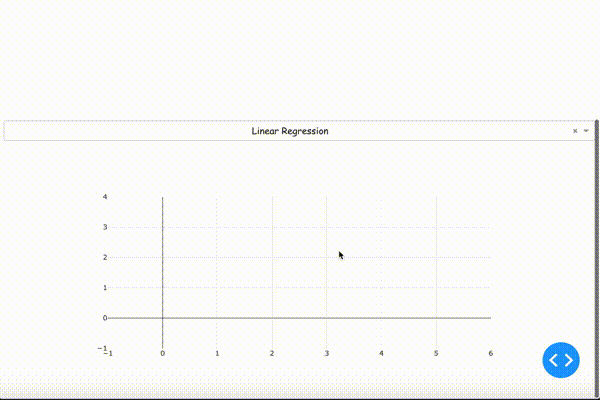

<!-- size: 4:3 -->

<style>
    section {
        background: #2A2B25;
        color:#FFFF;
        font-family: 'Noto Sans CJK JP';
        justify-content: flex-start;
    }
    h1{
        color:#D5EBDC;
    }
    p{
        color:#D5EBDC;
    }
    li {
        list-style-type: none;
    }
    li:before {
        content: '';
        width: 6px;
        height: 6px;
        display: inline-block;
        border-radius: 100%;
        background: grey;
        position: relative;
        left: -15px;
        top: -5px;
    }
</style>

<style scoped>
    section {
        justify-content: center;
    }
    p{
        text-align: center;
        margin-top: 10%;
        font-size: 18px;
    }
</style>

# Dash Hands-on

- Hands-onの目的
- Dashとは
- 今日作るもの

2019.11.06 佐々木 健佑

---

# Hands-onの目的

## その1

- アプリを作ったことがある状態にすること

---
<style scoped>
h6{
    font-size: 18px;
    text-align: right;
}
</style>
# Hands-onの目的

## その2

- データ分析の見せ方の選択肢を増やす
  - PowerPointのスライド
  - wordのレポート
  - application ← new

###### ※ アプリにして見せると話を聞いてくれる現場もあるらしい <br>(2019.10, 某広告代理店の人)

---

<style scoped>
h2{
    text-align: center;
}
h6{
    font-size: 18px;
    text-align: right;
}
</style>

# Dashとは

## 

- PythonのWebアプリケーションフレームワークの一つ
    - pythonだけで完結する(Rでもかけるらしい)
    - (no Javascript、HTML、CSS)
    - Dash自体はFlask、Pl   otly.js、React.jsでできてる

###### ※ フレームワーク : 枠組み、骨組み、組織、体制

---

# Dashとは

- Dashで作られたsample
    - [Dash App Gallery](https://dash-gallery.plotly.host/Portal/)


---

<style scoped>
h2 {
    text-align: center;
}
h6{
    font-size: 18px;
    text-align: right;
}
</style>

# Dashとは

- 一般的なアプリに必要なもの
    - アプリの外側のファイル (html、js、css) 
    - 内部処理のファイル (py)

## 
###### (https://www.kagoya.jp/howto/webhomepage/webapplication/)


---

<style scoped>
pre {
    background: #111111;
    font-size: 14px;
}
span {
    color: #91D6A7;
}
</style>

# Dashとは

- Dash appに必要なもの
    - 基本Pythonファイル一つだけ

app.py

```python
import dash

app = dash.Dash(__name__)

app.layout = html.Div(
    # アプリの見た目を記述する
)

# 入力と出力を指定する
@app.callback(
    Output(component_id='my-div', component_property='children'),
    [Input(component_id='my-id', component_property='value')]
)
# 処理を記述する
def update_output(input_value):
    return "inputに応じて返す内容"

if __name__ == '__main__':
    app.run_server(debug=True)
```
---
<style scoped>
h2 {
    text-align: center;
}
</style>

# 今日作るもの

- csvファイルをinputして機械学習するアプリ

## 
